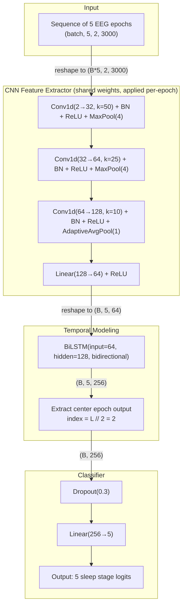
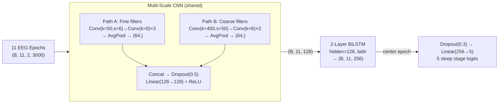
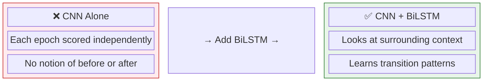
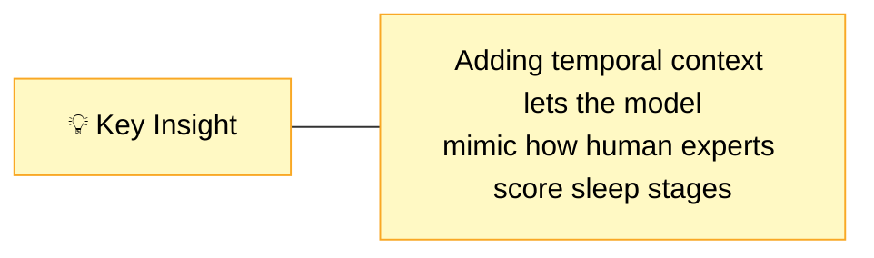
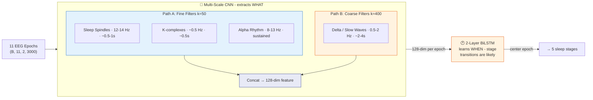
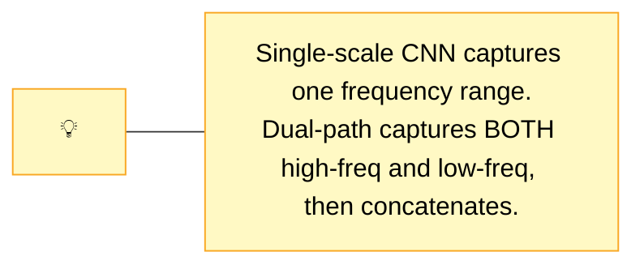
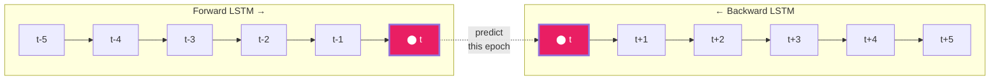
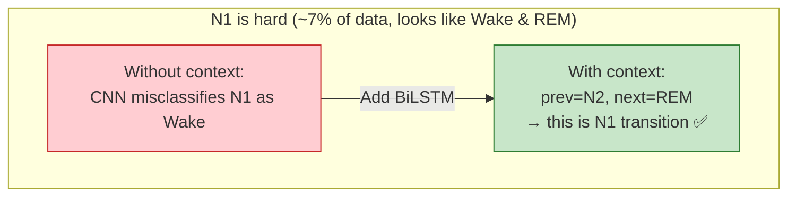
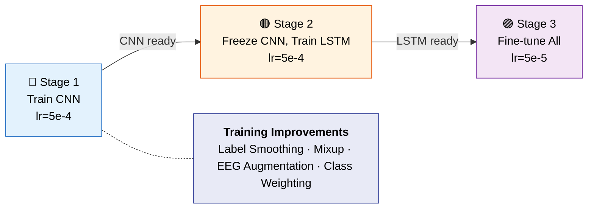

# CNN+BiLSTM Architecture Comparison: Temporal vs Enhanced

Side-by-side comparison of the two CNN+BiLSTM models for sleep stage classification.

- **Temporal**: `temporal/models.py` → `SleepCNNBiLSTM`
- **Enhanced**: `enhanced/models.py` → `SleepCNNBiLSTM` (with `cnn_type='multiscale'`)

---

## Architectural Differences

| Aspect | Temporal | Enhanced |
|---|---|---|
| **CNN Backbone** | Single-scale: 3 conv blocks (k=50→k=25→k=10) | **Multi-scale dual-path**: Path A (fine, k=50/8/8/8) + Path B (coarse, k=400/6/6/6) |
| **CNN Depth** | 3 conv layers | **4 conv layers per path** (8 total) |
| **CNN Output Dim** | 64 | **128** (2× wider) |
| **CNN Dropout** | None inside CNN | **Dropout(0.5)** between concat and FC |
| **LSTM Layers** | 1 | **2** (deeper recurrence) |
| **LSTM Input Size** | 64 | **128** |
| **LSTM Hidden Size** | 128 (output: 256) | 128 (output: 256) — same |
| **Classifier Input** | 256 (128×2 directions) | 256 — same |
| **Sequence Length** | L=5 (±2 epochs) | **L=11** (±5 epochs, more context) |
| **Batch Size** | 64 | **32** |
| **Learning Rate** | 1e-3 | **5e-4** |
| **Label Smoothing** | None | **0.05** |
| **Mixup Augmentation** | None | **α=0.1** |
| **Total Params** | ~345K | **~851K** (2.5× larger) |

---

## Key Differences Explained

### 1. Multi-Scale CNN Backbone
The enhanced model uses two parallel filter paths inspired by the original DeepSleepNet-Lite TensorFlow architecture:
- **Path A** (fine-grained, k=50 first layer): Captures high-frequency features like sleep spindles (~0.5s resolution)
- **Path B** (coarse, k=400 first layer): Captures slow temporal patterns like delta waves (~4s resolution)

The temporal model uses a single filter path that can only capture one scale of features.

### 2. Deeper LSTM (2 layers vs 1)
Two stacked LSTM layers let the enhanced model learn hierarchical temporal abstractions — the first layer captures local transitions (e.g., N2→N3), while the second layer can model longer-range patterns (e.g., sleep cycle structure).

### 3. Wider Feature Dimension (128 vs 64)
Doubling the CNN output from 64 to 128 dimensions gives the LSTM richer per-epoch representations to work with, at the cost of more parameters.

### 4. Longer Sequences (L=11 vs L=5)
L=11 provides ±5 epochs of context (±2.5 minutes) compared to ±2 epochs (±1 minute) in the temporal model. This is particularly helpful for disambiguating N1 vs REM, which often requires seeing the broader sleep stage trajectory.

### 5. Training Regularization
The enhanced model adds three regularization techniques absent from the temporal version:
- **Label smoothing (0.05)**: Softens one-hot targets to reduce overconfidence
- **Mixup (α=0.1)**: Interpolates random training pairs for smoother decision boundaries
- **CNN dropout (0.5)**: Applied after concatenating the two CNN paths

---

## Architecture Diagrams

### Temporal CNN+BiLSTM (from `temporal/`)



#### Tensor shapes (Temporal)

```plaintext
Input:         (B, 5, 2, 3000)    -- 5 epochs, 2 EEG channels, 3000 samples each
  reshape  --> (B*5, 2, 3000)     -- flatten batch and sequence for CNN

  conv1    --> (B*5, 32, 750)     -- k=50, stride=1, pad=25, then MaxPool(4)
  conv2    --> (B*5, 64, 187)     -- k=25, stride=1, pad=12, then MaxPool(4)
  conv3    --> (B*5, 128, 1)      -- k=10, stride=1, pad=5, then AdaptiveAvgPool(1)
  fc       --> (B*5, 64)          -- linear projection

  reshape  --> (B, 5, 64)         -- restore sequence dimension

  BiLSTM   --> (B, 5, 256)        -- 128 hidden × 2 directions
  center   --> (B, 256)           -- take position [2] (center of 5)

  dropout  --> (B, 256)
  linear   --> (B, 5)             -- 5 sleep stage classes
```

---

### Enhanced CNN+BiLSTM (from `enhanced/`)



#### Tensor shapes (Enhanced)

```plaintext
Input:         (B, 11, 2, 3000)   -- 11 epochs, 2 EEG channels, 3000 samples each
  reshape  --> (B*11, 2, 3000)    -- flatten batch and sequence for CNN

  Path A: conv1 → conv2 → conv3 → conv4 → AdaptiveAvgPool(1) → (B*11, 64)
  Path B: conv1 → conv2 → conv3 → conv4 → AdaptiveAvgPool(1) → (B*11, 64)
  concat   --> (B*11, 128)
  dropout  --> (B*11, 128)
  fc       --> (B*11, 128)        -- linear projection

  reshape  --> (B, 11, 128)       -- restore sequence dimension

  BiLSTM   --> (B, 11, 256)       -- 128 hidden × 2 directions (2 layers)
  center   --> (B, 256)           -- take position [5] (center of 11)

  dropout  --> (B, 256)
  linear   --> (B, 5)             -- 5 sleep stage classes
```

---

## Parameter Breakdown

### Temporal (~345K)

```plaintext
CNN Feature Extractor:  145,248  (conv1: 3,232  conv2: 51,264  conv3: 81,024  fc: 8,256  BN: 1,472)
BiLSTM:                 198,656  (64 input × 128 hidden × 4 gates × 2 directions + biases)
Classifier:               1,285  (256 × 5 + 5)
────────────────────────────────
Total:                  345,189
```

### Enhanced (~851K)

```plaintext
Multi-Scale CNN:        ~191,000  (Path A: ~56K  Path B: ~118K  merge FC: ~16K  BN: ~1K)
2-layer BiLSTM:         ~658,000  (layer 1: 128 in × 128 hidden × 4 × 2 + layer 2: 256 in × 128 hidden × 4 × 2)
Classifier:               1,285  (256 × 5 + 5)
────────────────────────────────
Total:                  ~851,000
```

---

## Training Pipeline Comparison

Both models use the same 3-stage training strategy, but with different hyperparameters:

| Training Aspect | Temporal | Enhanced |
|---|---|---|
| **Stage 1** (CNN pretrain) | Adam lr=1e-3, patience=15 | Adam lr=5e-4, patience=15 |
| **Stage 2** (LSTM, CNN frozen) | Adam lr=1e-3, patience=15, grad clip=1.0 | Adam lr=5e-4, patience=15, grad clip=1.0 |
| **Stage 3** (fine-tune all) | Adam lr=1e-4, patience=15, grad clip=1.0 | Adam lr=5e-5, patience=15, grad clip=1.0 |
| **LR Schedule** | ReduceLROnPlateau(patience=7, factor=0.5) | Cosine annealing with 3-epoch warmup |
| **Loss** | CrossEntropy with class weights | CrossEntropy with class weights + label smoothing (0.05) |
| **Data Augmentation** | None | Mixup (α=0.1), time shift, amplitude scaling, Gaussian noise |
| **Class Balancing** | `compute_class_weight('balanced')` | Same + optional `WeightedRandomSampler` |

---

## Enhanced CNN+BiLSTM — Slide-Ready Summary

### Slide 1: Why Add Temporal Modeling?

**Sleep stages are not independent — they follow a biological sequence.**






---

### Slide 2: Architecture Overview



---

### Slide 3: Why Multi-Scale CNN?

EEG signals contain features at different time scales:




---

### Slide 4: Why BiLSTM Helps

The bidirectional LSTM sees context in **both directions** — past and future epochs:





---

### Slide 5: Training Strategy



---

### Slide 6: Results (20-Fold LOSO-CV)

| Metric | CNN-Only Baseline | Enhanced CNN+BiLSTM |
|--------|-------------------|---------------------|
| Accuracy | 0.809 | **0.831** |
| Macro-F1 | 0.753 | **0.778** |
| Cohen's κ | 0.740 | **0.768** |
| Parameters | ~648K | ~851K |


