# SleepConformer — CNN + Conformer for Sleep Stage Classification

Architecture overview and slide-ready summary for the **SleepConformer** model from `enhanced/models.py`.

- **Source**: `enhanced/models.py` → `SleepConformer`
- **Backbone**: Multi-Scale CNN (same as Enhanced CNN+BiLSTM)
- **Temporal module**: 3× Conformer Blocks (Self-Attention + Depthwise Conv)
- **Total params**: ~1.34M

---

## What is a Conformer?

Originally from speech recognition (Gulati et al., 2020), the **Conformer** combines the best of Transformers and CNNs in a single block:

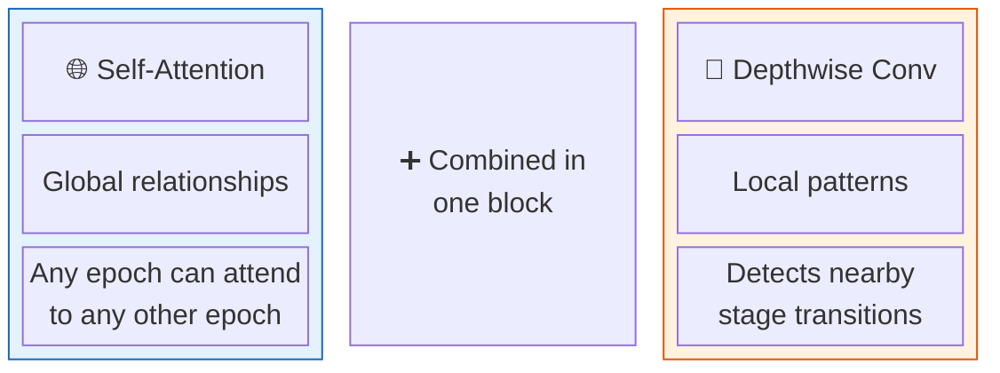

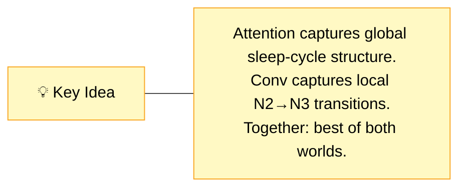

---

## Architecture at a Glance

| Aspect | Value |
|---|---|
| **CNN Backbone** | Multi-scale dual-path (Path A k=50 + Path B k=400) |
| **CNN Output Dim** | 128 |
| **Positional Encoding** | Learnable (max_len=25) |
| **Conformer Blocks** | 3 |
| **Attention Heads** | 4 |
| **Conv Kernel (depthwise)** | 7 |
| **FFN Expansion** | 4× (128→512→128) |
| **Dropout** | 0.2 |
| **Classifier Input** | 128 (center epoch from Conformer output) |
| **Sequence Length** | L=11 (±5 epochs) |
| **Total Params** | ~1,338,821 (~1.34M) |

---

## Architecture Diagram

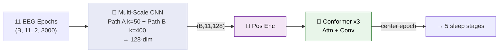

---

## Conformer Block — Internal Structure

Each Conformer block uses the **Macaron** structure (half-step FFN sandwich):

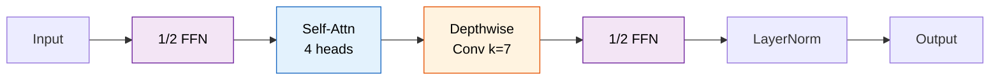

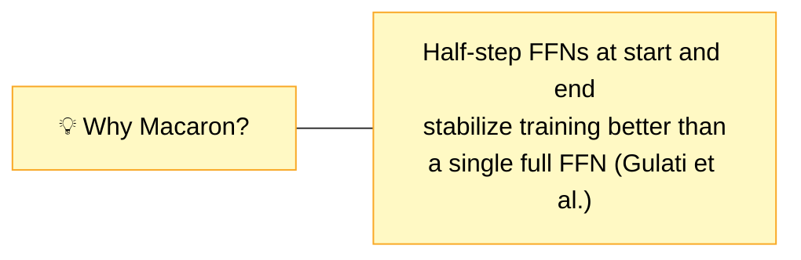

---

## Tensor Shapes

```plaintext
Input:         (B, 11, 2, 3000)   -- 11 epochs, 2 EEG channels, 3000 samples
  reshape  --> (B*11, 2, 3000)    -- flatten for CNN

  Path A: conv1→conv2→conv3→conv4→AvgPool(1) → (B*11, 64)
  Path B: conv1→conv2→conv3→conv4→AvgPool(1) → (B*11, 64)
  concat   --> (B*11, 128)
  dropout  --> (B*11, 128)
  fc       --> (B*11, 128)

  reshape  --> (B, 11, 128)       -- restore sequence dimension
  pos_enc  --> (B, 11, 128)       -- add learnable position

  Conformer Block ×3:
    ½ FFN    --> (B, 11, 128)     -- 128→512→128 with 0.5 residual
    MHSA     --> (B, 11, 128)     -- 4 heads, d_k=32
    Conv     --> (B, 11, 128)     -- depthwise k=7
    ½ FFN    --> (B, 11, 128)     -- 128→512→128 with 0.5 residual
    LayerNorm

  final_norm --> (B, 11, 128)
  center     --> (B, 128)         -- take position [5] (center of 11)

  dropout    --> (B, 128)
  linear     --> (B, 5)           -- 5 sleep stage classes
```

---

## Parameter Breakdown (~1.34M)

```plaintext
Multi-Scale CNN:        ~191,000  (Path A: ~56K  Path B: ~118K  merge FC: ~16K)
Positional Encoding:         2,816  (1 × 25 × 128 — learnable, but only 11 used)
Conformer Block ×3:    ~1,143,000  (per block: ~381K)
  ├─ ½ FFN₁:             131,712  (LN:256 + 128×512 + 512×128 = 131,456)
  ├─ MHSA:                66,048  (LN:256 + 4-head attn: 128→128 Q/K/V/O)
  ├─ Conv Module:          51,072  (LN:256 + pointwise:32K + depthwise + BN + pointwise)
  └─ ½ FFN₂ + final LN:  131,968
Classifier:                  645  (128 × 5 + 5)
────────────────────────────────
Total:                 ~1,338,821
```

---

## Training Configuration

| Training Aspect | Value |
|---|---|
| **Optimizer** | Adam |
| **Learning Rate** | 3e-4 |
| **Weight Decay** | 1e-4 |
| **Max Epochs** | 80 |
| **Patience** | 20 |
| **Batch Size** | 32 |
| **Sequence Length** | 11 |
| **Loss** | **Focal Loss** (γ=1.5) + label smoothing (0.05) |
| **Mixup** | α=0.1 |
| **LR Schedule** | Cosine annealing with 3-epoch warmup |
| **Class Balancing** | Class-weighted loss + optional WeightedRandomSampler |

---

## Conformer vs CNN+BiLSTM — Comparison

| Aspect | Enhanced CNN+BiLSTM | SleepConformer |
|---|---|---|
| **Temporal module** | 2-Layer BiLSTM | 3× Conformer Blocks |
| **Attention** | None (sequential only) | **4-head self-attention** |
| **Local patterns** | BiLSTM hidden state | **Depthwise conv (k=7)** |
| **Positional info** | Implicit (LSTM order) | **Learnable positional encoding** |
| **Classifier input** | 256 (128×2 directions) | 128 (direct from Conformer) |
| **Loss function** | CrossEntropy | **Focal Loss (γ=1.5)** — harder examples weighted more |
| **Dropout** | 0.3 | 0.2 |
| **Learning Rate** | 5e-4 | 3e-4 |
| **Max Epochs** | 60 | **80** |
| **Patience** | 15 | **20** |
| **Total Params** | ~851K | **~1.34M** (1.6× larger) |

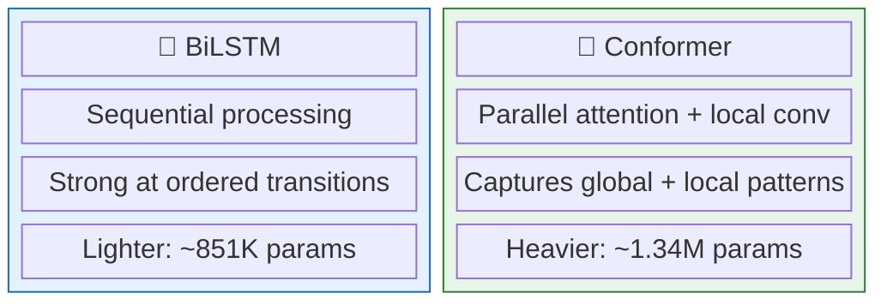

---

## Results (20-Fold LOSO-CV)

| Metric | CNN+BiLSTM | Conformer |
|--------|-----------|-----------|
| Accuracy | **0.841** | 0.829 |
| Macro-F1 | **0.791** | 0.780 |
| Weighted-F1 | **0.847** | 0.835 |
| Cohen's κ | **0.783** | 0.769 |
| Parameters | ~851K | ~1.34M |

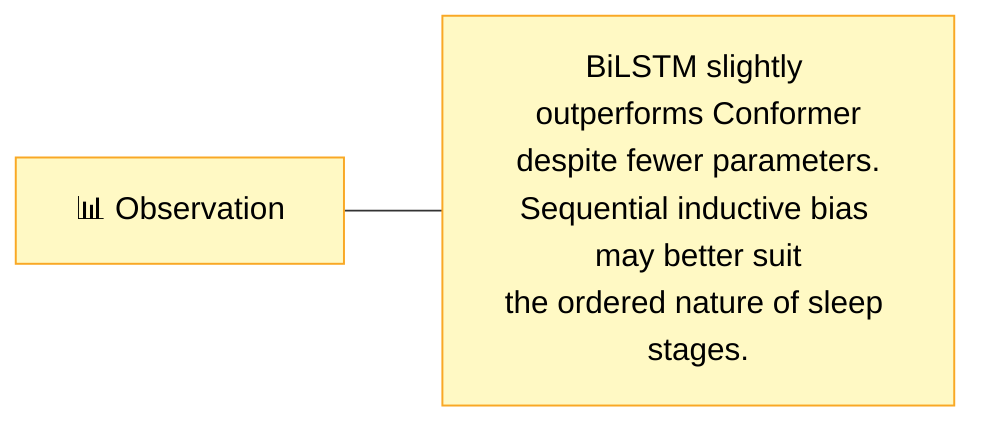

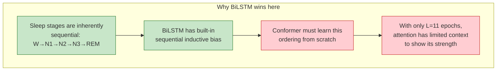

---

## SleepConformer — Slide-Ready Summary

### Slide 1: Why Conformer? (CNN-Only Limitations)

**CNN alone scores each epoch in isolation — it cannot see the sequence.**

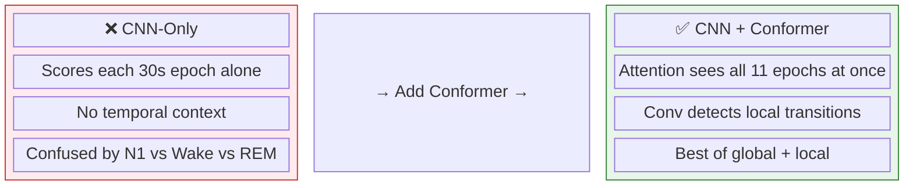

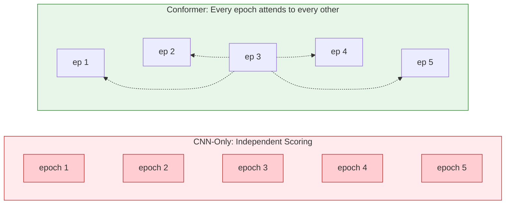

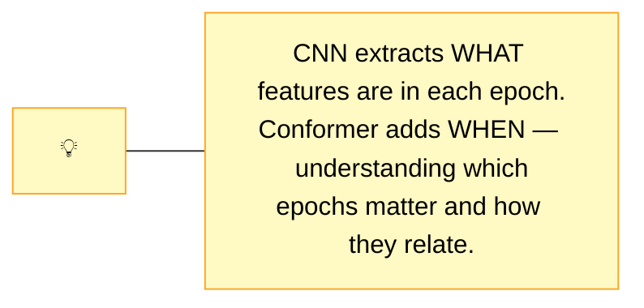

---

### Slide 2: What is a Conformer?

**Combines the best of Transformers and CNNs in each block.**

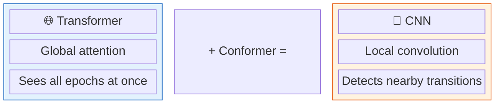

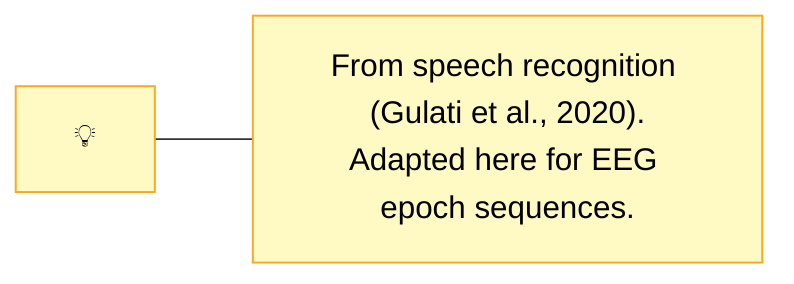

---

### Slide 3: Architecture Overview

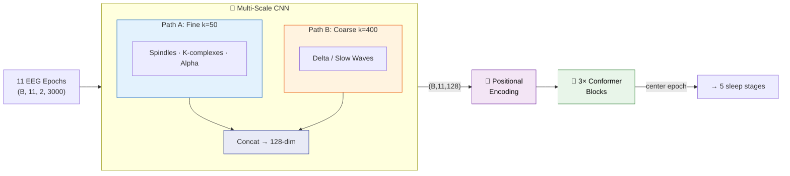

---

### Slide 4: Inside a Conformer Block

**Macaron sandwich: ½ FFN → Attention → Conv → ½ FFN**

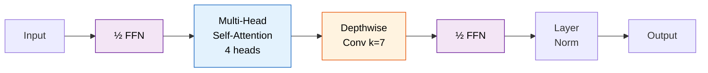

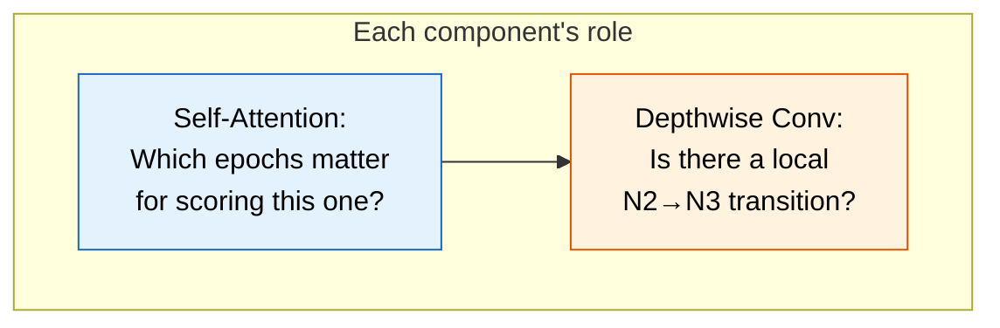

---

### Slide 5: Conformer vs BiLSTM — How They See Context

```mermaid
flowchart TD
    subgraph bilstm["BiLSTM: Sequential Scanning"]
        direction LR
        L1["t-5"] -->|"→"| L2["t-4"] -->|"→"| L3["t-3"] -->|"→"| L4["t-2"] -->|"→"| L5["t-1"] -->|"→"| L6["⬤ t"]
        R6["⬤ t"] -->|"←"| R5["t+1"] -->|"←"| R4["t+2"] -->|"←"| R3["t+3"] -->|"←"| R2["t+4"] -->|"←"| R1["t+5"]
    end

    subgraph conformer["Conformer: Parallel Attention + Local Conv"]
        direction LR
        C1["t-5"] ~~~ C2["t-4"] ~~~ C3["t-3"] ~~~ C4["t-2"] ~~~ C5["t-1"] ~~~ C6["⬤ t"] ~~~ C7["t+1"] ~~~ C8["t+2"] ~~~ C9["t+3"] ~~~ C10["t+4"] ~~~ C11["t+5"]
        C6 -.->|"attends to all"| C1
        C6 -.->|"attends to all"| C4
        C6 -.->|"attends to all"| C11
    end

    style L6 fill:#E91E63,color:#fff,stroke-width:3px
    style R6 fill:#E91E63,color:#fff,stroke-width:3px
    style C6 fill:#E91E63,color:#fff,stroke-width:3px
    style bilstm fill:#e3f2fd,stroke:#1565C0
    style conformer fill:#e8f5e9,stroke:#2e7d32
```

---

### Slide 6: Training Strategy

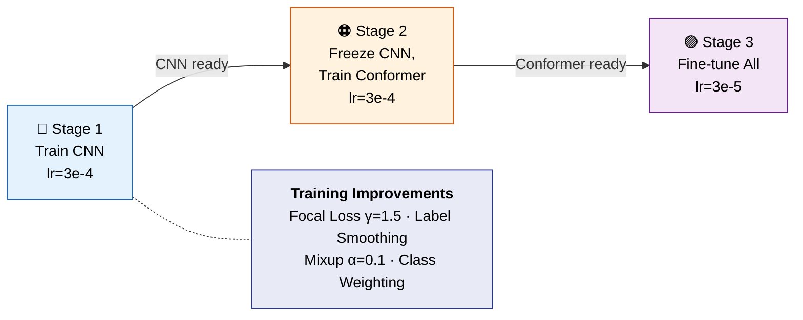

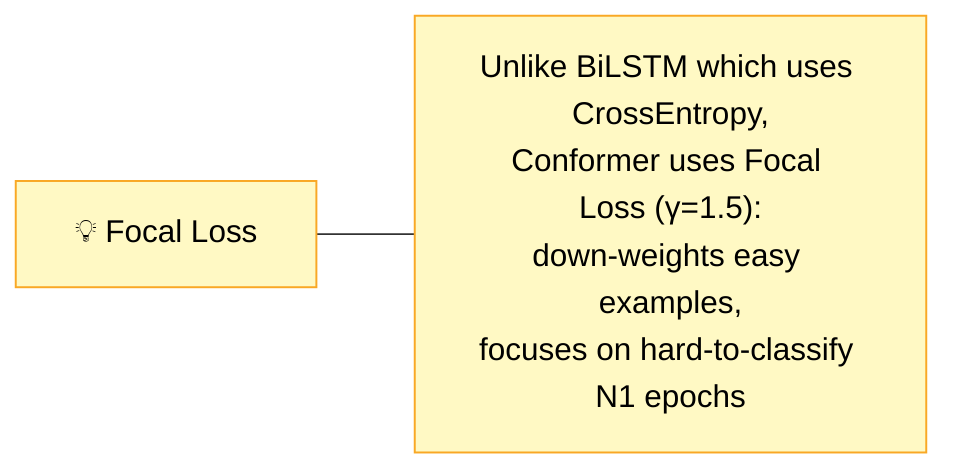

---

### Slide 7: Results (20-Fold LOSO-CV)

| Metric | CNN+BiLSTM | SleepConformer |
|--------|-----------|----------------|
| Accuracy | **0.841** | 0.829 |
| Macro-F1 | **0.791** | 0.780 |
| Cohen's κ | **0.783** | 0.769 |
| Parameters | ~851K | ~1.34M |

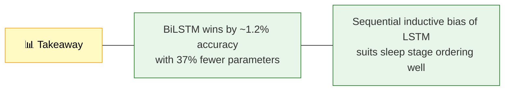

```mermaid
flowchart LR
    subgraph future["Potential Improvements for Conformer"]
        direction LR
        F1["Longer sequences<br/>L=21 or L=31"]:::idea --> F2["More training data<br/>attention is data-hungry"]:::idea --> F3["Pre-training on<br/>larger sleep datasets"]:::idea
    end
    classDef idea fill:#e3f2fd,stroke:#1565C0,color:#000
```
