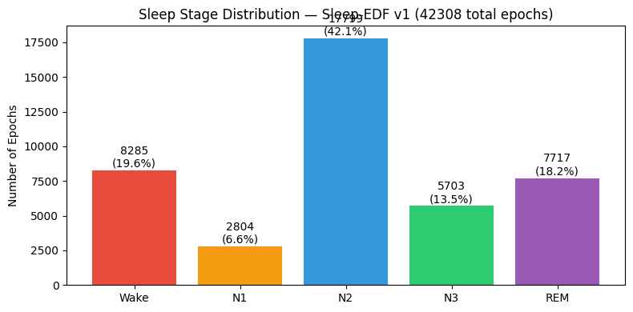
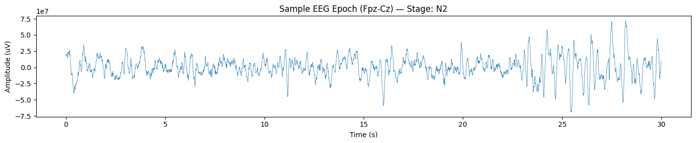

# SleepStageNet: Team Handoff Document

## Project Overview

| | |
| ---- | ---- |
| **Course** | CSEP 590A Deep Learning |
| **Task** | 5-class sleep stage classification (Wake, N1, N2, N3, REM) from raw EEG |
| **Dataset** | Sleep-EDF v1 from PhysioNet — 39 recordings, 20 subjects, 42,230 epochs (30s each, Fpz-Cz channel, 100Hz) |
| **Evaluation** | 20-fold leave-one-subject-out cross-validation (LOSO-CV) |

---

## What's Already Done

### 1. Data Pipeline (Complete)

- Sleep-EDF data preprocessed into `.npz` files (3000 samples per epoch)
- Hosted on Google Drive for fast download via `gdown` (~28s)
- 20-fold LOSO-CV splits generated (`data_split_v1.npz`)

### 2. Baseline Model: DeepSleepNet-Lite (Complete)

- Architecture: Dual parallel 1D-CNN paths (fine-grained + coarse temporal filters) on 90-second windows (3 consecutive epochs)
- All TF 2.x compatibility issues resolved (runs on Colab with TF 2.19, Python 3.12, T4 GPU)
- Full 20-fold training complete, checkpoints saved to Google Drive
- Prediction and evaluation pipeline working end-to-end

### 3. Colab Notebook (Complete)

- **Repo:** `https://github.com/manishdas/deepsleepnet-lite`
- **Baseline notebook:** `notebooks/DeepSleepNet_Lite_BaseLineColab.ipynb` (with saved outputs)
- **Template notebook:** `notebooks/DeepSleepNet_Lite_Colab.ipynb` (for new experiments)
- Teammates can restore all 20 pre-trained fold models in ~13s via `gdown` (no retraining needed)
- Auto-saves new models to Drive after each fold (survives Colab disconnects)

### 4. Baseline Results (20-fold LOSO-CV)

| Metric | Value |
| ------ | ----- |
| Overall Accuracy | 0.8092 |
| Macro F1 | 0.7527 |
| Weighted F1 | 0.8113 |
| Cohen's Kappa | 0.7400 |
| ECE (Expected Calibration Error) | 0.1099 |

**Per-class F1 scores:**

| Stage | F1 | Precision | Recall | Support |
| ----- | --- | --------- | ------ | ------- |
| Wake (W) | 0.802 | 0.852 | 0.759 | 8,207 |
| N1 | 0.441 | 0.408 | 0.481 | 2,804 |
| N2 | 0.865 | 0.879 | 0.852 | 17,799 |
| N3 | 0.859 | 0.817 | 0.905 | 5,703 |
| REM | 0.795 | 0.780 | 0.811 | 7,717 |

**Key observation:** N1 (light sleep) is the clear bottleneck at 0.441 F1. It's frequently confused with Wake (379 misclassified) and REM (428 misclassified). This is expected — N1 is inherently ambiguous and severely underrepresented (6.6% of data vs. N2 at 42.1%).

#### Class Distribution



#### Confusion Matrices


#### Per-Class F1 & Training Curves (mean +/- std across 20 folds)


#### Sample EEG Epoch



> All figures and results are also available on [Google Drive](https://drive.google.com/drive/u/0/folders/1S-RIIPcetbevDHsgY6hutbXkAKefsV5C).

---

## What Needs to Happen Next

All improvements build on top of the baseline. The goal is to show measurable gains over DeepSleepNet-Lite using the same 20-fold LOSO-CV protocol.

### Improvement 1: Temporal Context Modeling

**Goal:** Show that modeling transitions between sleep stages improves performance.
**Options (pick one or two):**

- **BiLSTM on top of CNN features:** Extract CNN features from DeepSleepNet-Lite, feed sequence into BiLSTM
- **Self-attention / Transformer block:** Add attention over the 3-epoch sequence
- **Longer sequence context:** Extend input from 3 epochs (90s) to 5-7 epochs
- **Effort:** ~3-5 days, most complex stage
- **Expected result:** +1-3% accuracy, +2-5% on N1 F1

### Improvement 2: Class Imbalance Mitigation

**Goal:** Improve N1 detection (our weakest class).
**Options:**

- **Focal loss:** Replace cross-entropy with focal loss (down-weights easy examples, focuses on hard ones like N1). Simplest change — modify loss function in `train.py`
- **Class-weighted cross-entropy:** Weight the loss inversely proportional to class frequency
- **Data augmentation:** Time shifts, Gaussian noise, amplitude scaling on minority classes
- **Effort:** Focal loss is ~half a day; augmentation is ~1-2 days
- **Expected result:** N1 F1 improvement from 0.44 to 0.48-0.52

### Improvement 3: Interpretability

**Goal:** Visualize what the model learns, relate to known sleep physiology.
**What to do:**

- Grad-CAM or saliency maps on the CNN filters
- Show that the model attends to known EEG patterns (delta waves in N3, sleep spindles in N2, etc.)
- Attention weight visualizations if using attention-based temporal model
- **Effort:** ~1-2 days
- **Expected result:** Qualitative figures for the report/presentation

---

## Suggested Task Assignment (5 people)

### RACI Matrix

**R** = Responsible (does the work), **A** = Accountable (owns the outcome), **C** = Consulted, **I** = Informed

| Task | Manish | Shrinivas | Nithin | Regith | Thangakumar |
| ---- | ------ | --------- | ------ | ------ | ----------- |
| Data pipeline & baseline setup | **R/A** (Done) | I | I | **R** (Done) | I |
| Colab notebook & infra | **R/A** (Done) | I | I | **R** (Done) | I |
| Focal loss / class-weighted loss | C | **R/A** | I | I | C |
| Temporal context (BiLSTM/Attention) | C | C | **R/A** | **R** | C |
| Data augmentation | C | C | C | **R/A** | I |
| Interpretability (Grad-CAM/saliency) | I | C | C | I | **R/A** |
| Presentation slides | C | C | C | C | **R/A** |
| Final report (own section) | **R** | **R** | **R** | **R** | **R** |

**Notes:**

- Manish & Regith: Set up the baseline pipeline (data, model, training, evaluation, Colab infra). Available to consult on codebase questions.
- Everyone is responsible for running their experiments using the same 20-fold LOSO-CV protocol and reporting results in the comparison table format.
- All code should be committed to the repo. Create a new notebook for each experiment (e.g., `DeepSleepNet_Lite_FocalLoss_Colab.ipynb`).

---

## Metrics Explained (in context of this project)

### Class Distribution — Why Metrics Matter


The dataset is heavily imbalanced: N2 alone makes up 42.1% of all epochs, while N1 is only 6.6%. This imbalance is why we need multiple metrics — accuracy alone would be misleading since a model that always predicts N2 gets 42% accuracy for free.

---

### Overall Accuracy

- **What:** Fraction of correctly classified epochs out of all epochs.
- **Our value:** 0.8092 (80.9%)
- **Why it matters:** Simple to understand, but misleading with imbalanced data. Our 80.9% accuracy sounds good, but it's heavily driven by getting N2 right (17,799 samples). The model could completely fail on N1 (2,804 samples) and barely affect accuracy.
- **Limitation:** Doesn't reflect poor N1 performance (only 6.6% of data).

> **Baseline:** 34,171 correct out of 42,230 total epochs = **80.92%**

### Macro F1 Score

- **What:** Unweighted average of per-class F1 scores. Treats all 5 classes equally regardless of size.
- **Our value:** 0.7527
- **Why it matters:** This is our **primary metric**. It penalizes the model for doing poorly on rare classes (N1). A model that ignores N1 entirely would have Macro-F1 around 0.60 even with high accuracy.
- **How to improve:** Improving N1 has the biggest impact here since it drags down the average.

> **Baseline calculation:** (0.802 + 0.441 + 0.865 + 0.859 + 0.795) / 5 = **0.7527**
> Notice how N1's 0.441 pulls the average well below the other four classes (~0.83).

### Weighted F1 Score

- **What:** Average of per-class F1 scores, weighted by class support (number of samples).
- **Our value:** 0.8113
- **Why it matters:** Reflects performance proportional to how often each stage appears. It's higher than Macro-F1 (0.811 vs 0.753) because the model does well on frequent classes (N2, W, REM) which carry more weight. The gap between Weighted F1 and Macro F1 (0.059) directly quantifies how much the model struggles on rare classes.

> | Metric | Value | What it tells us |
> | ------ | ----- | ---------------- |
> | Macro F1 | 0.7527 | All classes weighted equally — dragged down by N1 |
> | Weighted F1 | 0.8113 | Proportional to class size — N2 dominates |
> | Gap | 0.059 | Larger gap = worse performance on rare classes |

### Cohen's Kappa

- **What:** Agreement between predictions and ground truth, corrected for chance agreement. Ranges from -1 to 1 (0 = random, 1 = perfect).
- **Our value:** 0.7400
- **Why it matters:** Standard metric in clinical sleep staging. A kappa of 0.74 indicates "substantial agreement" (0.61-0.80 range). For reference, inter-scorer agreement between human experts is typically kappa ~0.75-0.85. Our model is approaching the lower end of human-level agreement.
- **Clinical threshold:** Kappa > 0.60 is generally considered clinically usable.

> | Kappa Range | Interpretation | Where we stand |
> | ----------- | -------------- | -------------- |
> | < 0.20 | Poor | |
> | 0.21 – 0.40 | Fair | |
> | 0.41 – 0.60 | Moderate | |
> | 0.61 – 0.80 | Substantial | **Baseline: 0.740** |
> | 0.81 – 1.00 | Almost perfect | Human experts: ~0.75–0.85 |

### Per-class F1 Score


The left panel shows per-class F1 scores. The right panel shows training curves averaged across all 20 folds (shaded region = standard deviation).

- **What:** Harmonic mean of precision and recall for each individual class.
- **Why it matters:** Reveals which stages the model struggles with. F1 balances two failure modes:
  - **Low precision** = too many false positives (predicting N1 when it's actually W/REM)
  - **Low recall** = too many false negatives (missing actual N1 epochs)
- **Our weak spot:** N1 at 0.441 — the model misses over half of N1 epochs. The gray dashed line shows the Macro F1 (0.753). N1 is the only class significantly below this line, making it the primary target for improvement.
- **Training curves insight:** The training loss converges well, but there's a gap between train and valid loss, suggesting some overfitting. The std shading shows that some folds are harder than others (subject variability).

### Precision and Recall (per class)

- **Precision:** Of all epochs the model *predicted* as class X, what fraction were actually X?
- **Recall (Sensitivity):** Of all epochs that *are* class X, what fraction did the model correctly identify?

> | Stage | Precision | Recall | Interpretation |
> | ----- | --------- | ------ | -------------- |
> | W | 0.852 | 0.759 | Good precision, but misses 24% of wake epochs |
> | N1 | 0.408 | 0.481 | Both low — model both over- and under-predicts N1 |
> | N2 | 0.879 | 0.852 | Strong on both — benefits from being the majority class |
> | N3 | 0.817 | 0.905 | High recall (finds 91% of deep sleep), some false positives from N2 |
> | REM | 0.780 | 0.811 | Decent, but some REM epochs get confused with N1 and N2 |

### Expected Calibration Error (ECE)

- **What:** Measures how well the model's confidence scores match its actual accuracy. ECE=0 means perfect calibration.
- **Our value:** 0.1099 (~11%)
- **Why it matters:** When the model says it's 90% confident, is it actually correct 90% of the time? An ECE of 0.11 means there's about an 11% gap between confidence and accuracy on average. Important for clinical trust — doctors need to know when the model is uncertain.
- **Context:** The "On Selected" results (after removing the 5% least-confident predictions) show accuracy improves from 80.9% to 83.0%, confirming that the model's confidence scores are somewhat informative — low-confidence predictions are indeed more likely to be wrong.

> | | All predictions | After removing 5% least confident |
> | ---- | ---- | ---- |
> | Accuracy | 80.9% | 83.0% |
> | Macro F1 | 0.753 | 0.771 |
> | Confidence (mean) | 0.919 | 0.940 |
> | ECE | 0.110 | 0.110 |
>
> Removing uncertain predictions improves accuracy by ~2%, confirming the model "knows when it doesn't know."

### Confusion Matrix (how to read it)


The left matrix shows raw counts, the right shows row-normalized values (each row sums to 1.00).

- **Rows** = true labels (what the epoch actually is)
- **Columns** = predicted labels (what the model said)
- **Diagonal** = correct predictions (darker blue = better)
- **Off-diagonal** = misclassifications (ideally all zeros)
- **Key patterns in our baseline:**
  - **N1 row is the weakest** — only 0.48 on the diagonal. N1 epochs get scattered to W (0.14), N2 (0.22), and REM (0.15). This makes sense: N1 is a transitional stage with EEG features overlapping both wakefulness and REM.
  - **N2 ↔ N3 confusion** — 946 N2 epochs misclassified as N3. These are adjacent NREM stages, and the boundary between them (amount of delta wave activity) can be ambiguous.
  - **N3 is well-isolated** — 0.91 on the diagonal, very few errors. Deep sleep has distinctive high-amplitude delta waves that the CNN captures well.
  - **W ↔ N1 and W ↔ REM** — Wake is confused with N1 (913) and REM (618). Drowsy wakefulness resembles light sleep, and wake with eyes closed can have alpha activity similar to REM.
  - **What to watch for in improvements:** When we add focal loss or temporal context, check if N1's diagonal value increases and if the off-diagonal scatter decreases. The confusion matrix tells the full story that a single F1 number cannot.

---

## Metrics Comparison Table (to fill in as experiments complete)

| Model | Accuracy | Macro F1 | Weighted F1 | Kappa | W F1 | N1 F1 | N2 F1 | N3 F1 | REM F1 | ECE |
| ----- | -------- | -------- | ----------- | ----- | ---- | ----- | ----- | ----- | ------ | --- |
| **DeepSleepNet-Lite (baseline)** | **0.8092** | **0.7527** | **0.8113** | **0.7400** | **0.802** | **0.441** | **0.865** | **0.859** | **0.795** | **0.110** |
| + Focal Loss | — | — | — | — | — | — | — | — | — | — |
| + Temporal Context (BiLSTM) | 0.831 | 0.778 | 0.837 | 0.768 | 0.874 | 0.477 | 0.859 | 0.868 | 0.813 | — |
| + Both | — | — | — | — | — | — | — | — | — | — |

*BiLSTM results are full 20-fold LOSO-CV (Kaggle P100). See `temporal/README.md` for architecture and training details.*

**Primary comparison metric:** Macro F1 (treats all classes equally)
**Secondary:** Cohen's Kappa (clinical relevance), N1 F1 (our weakest class)

---

## How to Run Experiments

1. Clone the repo and open the Colab notebook
2. Run Cells 1-2 (setup + data download)
3. Run the model restore cell (downloads pre-trained baseline in ~13s)
4. For new experiments: copy the training cell, modify as needed (loss function, architecture, etc.)
5. Use the **same 20-fold LOSO-CV** with the same data splits
6. Save results using the same prediction/evaluation pipeline
7. Add your row to the comparison table above

**Important:** All experiments must use the same evaluation protocol for fair comparison. The 20-fold splits are fixed in `data/data_split_v1.npz`.

---

## Repository Structure

```plaintext
deepsleepnet-lite/
├── notebooks/
│   ├── DeepSleepNet_Lite_BaseLineColab.ipynb  # Baseline with outputs
│   └── DeepSleepNet_Lite_Colab.ipynb          # Template for experiments
├── deepsleeplite/                              # Model code
│   ├── model.py                                # DeepSleepNet-Lite architecture
│   ├── nn.py                                   # Neural network layers
│   ├── data_loader.py                          # Data loading + CV splits
│   └── utils.py                                # Training utilities
├── temporal/                                   # CNN+BiLSTM temporal model
│   ├── data_loader.py                          # Sliding-window sequences, PyTorch Datasets
│   ├── models.py                               # CNN feature extractor + BiLSTM
│   ├── train_sequence.py                       # 3-stage training with logging, JSON results
│   ├── plot_results.py                         # Single-fold and aggregated plotting
│   ├── SleepStageNet_CNN_BiLSTM_Colab.ipynb   # Colab notebook for T4 GPU
│   ├── output/                                 # Checkpoints, logs, per-fold JSON results
│   └── figures/                                # Generated plots
├── train.py                                    # Training entry point
├── predict.py                                  # Prediction entry point
├── summary_muquery.py                          # Evaluation metrics
├── prepare_physionet.py                        # Data preprocessing
├── results/                                    # CSV results
└── figures/                                    # Generated plots
```

## Google Drive Structure

```plaintext
MyDrive/SleepStageNet/
├── baseline_models.zip          # All 20 folds (276MB, shared via gdown)
├── models/v1/base/fold0-19/     # Individual fold checkpoints
├── results/                     # Prediction outputs
└── figures/                     # Plots
```
