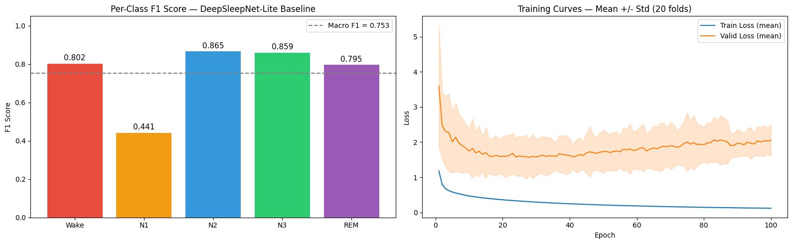
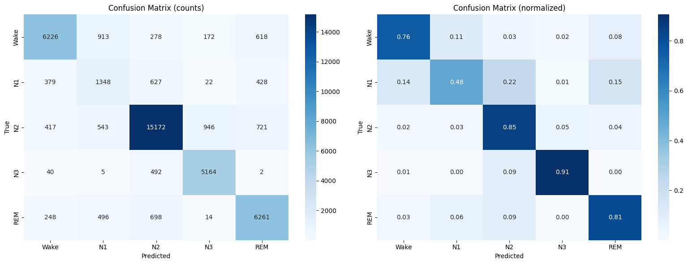

# SleepStageNet: Deep Learning for Automated Sleep Stage Classification

## Slide-1: SleepStageNet: Deep Learning forAutomated Sleep Stage Classification

CSEP 590A Deep Learning  |  Group Project
 •  Manish Das  • Nithin Balachandran  • Regith Lingesh •  Shrinivas Acharya  • Thangakumar Dhanasekaran

## Slide-2: Problem & Motivation

•  Sleep disorders affect millions worldwide
•  Diagnosis requires overnight polysomnography (PSG) — expensive, manual, expert-dependent
    –  A trained technician takes 2–4 hours to score one night (800–1000 epochs)
•  Goal: Automate 5-class sleep stage classification from raw EEG signals
•  Clinical impact: Reduce cost, enable scalable sleep monitoring

## Slide-3: Sleep Stages

•  5 classes per AASM guidelines:
    –  Wake (W) — alert / drowsy
    –  N1 — light sleep, transition stage
    –  N2 — intermediate sleep, sleep spindles
    –  N3 — deep / slow-wave sleep, delta waves
    –  REM — Rapid Eye Movement, dreaming
•  Each 30-second epoch is classified independently
100 Hz, 30 s epoch (3000 samples), Fpz-Cz channel

## Slide-4: Dataset

•  Sleep-EDF v1 from PhysioNet (public benchmark)
    –  39 whole-night PSG recordings from 20 healthy subjects
    –  EEG channel: Fpz-Cz at 100 Hz → 3000 samples per 30 s epoch
    –  42,230 total epochs across all recordings
Note: The dataset is heavily imbalanced: N2 alone makes up 42.1% of all epochs while N1 is only 6.6%.
         This imbalance is why we need multiple metrics — accuracy alone would be misleading (a model predicting all N2 gets 42%)

## Slide-5: Evaluation

1. Overall Accuracy
    - What: Fraction of correctly classified epochs out of all epochs.
    - Why it matters: Simple to understand, but misleading with imbalanced data.
    - Limitation: Doesn't reflect poor N1 performance (only 6.6% of data).
2. Macro F1 Score
    - What: Unweighted average of per-class F1 scores. Treats all 5 classes equally regardless of size.
    - Why it matters: This is our primary metric. It penalizes the model for doing poorly on rare classes (N1).
3. Weighted F1 Score
    - What: Average of per-class F1 scores, weighted by class support (number of samples).
    - Why it matters: Reflects performance proportional to how often each stage appears.

## Slide-6: Evaluation

4. Cohen's Kappa
    - What: Agreement between predictions and ground truth, corrected for chance agreement. Ranges from -1 to 1 (0 = random, 1 = perfect).
    - Why it matters: Standard metric in clinical sleep staging. For reference, interscorer agreement between human experts is typically kappa ~0.75-0.85. Clinical threshold: Kappa > 0.60

Evaluation Protocol: 20-fold Leave-One-Subject-Out Cross-Validation (LOSO-CV)
    - Each fold: train on 19 subjects, test on 1 held-out subject
    - Ensures model generalizes to unseen subjects (no data leakage)

## Slide-7: Approach Overview

Start from a strong CNN baseline, then improve systematically:
•  Model 1→  Baseline: CNN Only
–  Multi-scale dual-path CNN: small filters (~0.5s) capture spindles, large filters (~4s) capture slow waves
•  Model 2  →  Temporal: CNN + BiLSTM
–  Same CNN extracts per-epoch features → 2-layer BiLSTM learns sleep stage transitions across epochs
•  Model 3  →  Conformer: CNN + Transformer
–  Replaces BiLSTM with Conformer blocks: self-attention (global patterns) + depthwise conv (local transitions)
•  All experiments compared via the same 20-fold LOSO-CV protocol

| Model | Architecture | Params |
| ----- | ------------ | ------ |
| CNN Only | Dual-path multi-scale CNN | ~191K |
| CNN+BiLSTM | Multi-scale CNN + 2-layer BiLSTM | ~851K |
| Conformer | Multi-scale CNN + Conformer blocks | ~1.34M |

## Slide-8: Baseline

TRANSITION SLIDE

## Slide-9: Baseline Architecture — DeepSleepNet-Lite

•  Input: 90-second window (3 × 30 s epochs) = 9,000 samples
•  Dual parallel CNN paths:
    –  Path 1: Small filters (~50 samples) — fine-grained, high-frequency features
    –  Path 2: Large filters (~400 samples) — coarse, low-frequency features
•  Concatenated features → Fully Connected → Softmax (5 classes)
•  Training: Adam optimizer, lr = 1e-4, 100 epochs, batch size 100
•  Oversampling applied to handle class imbalance during training

## Slide-10: Baseline - Architecture of DeepSleepNet-Lite

## Slide-11: Baseline Results: Per-Class F1 and Training Curves

Baseline Model Achieves 0.753 Macro F1 Across 5 Sleep Stages

## Slide-12: Confusion Matrix

N3 and N2 Classified Well; N1 Confusion PersistsModel Excels at N2/N3, Struggles Most with N1 (48% Recall)

## Slide-13: Temporal Model

TRANSITION SLIDE

## Slide-14: Why Temporal Modeling?

- Sleep stages are not independent — they follow a biological sequence.

- CNN + BiLSTM

## Slide-15: Improvement — Temporal Context Modeling

•  Problem: CNN classifies each epoch mostly independently
    –  Ignores natural temporal progression of sleep stages
•  Solution: BiLSTM over a sequence of CNN epoch features
•  3-stage training

## Slide-16: Temporal Model Architecture

## Slide-17: Conformer Model

TRANSITION SLIDE

## Slide-18: Why Conformer Model?

Attention captures global sleep cycles, convolution captures local N2 -> N3 transitions. Together: Best of both worlds!

[General README](../enhanced/README.md)

Conformer vs BiLSTM — How They See Context:

[General README](../enhanced/README.md)

## Slide-19: Conformer Model Architecture

Originally from speech recognition (Gulati et al., 2020), the Conformer combines the best of Transformers and CNNs in a single block

[General README](../enhanced/README.md)
Each Conformer block uses the Macaron structure (half-step FFN sandwich):

[General README](../enhanced/README.md)

## Slide-20: Training

Multi-Stage Training

[General README](../enhanced/README.md)

## Slide-21: Results

TRANSITION SLIDE

## Slide-22: Results Comparison

| Model | Accuracy | Macro F1 | Cohen's κ | N1 F1 |
| ----- | -------- | -------- | --------- | ------|
| Baseline  (DeepSleepNet-Lite) | 80.9% | 0.753 | 0.740 | 0.441 |
| Temporal  (CNN + BiLSTM)  ★ | 83.9% ± 6.5% | 0.79 ± 0.067 | 0.778 ± 0.091 | 0.519 |
| Conformer (CNN + Transformer) | 83.0% ± 7.3% | 0.78 ± 0.07 | 0.768 ± 0.1 | 0.500 |

Per-Class F1  (Temporal CNN+BiLSTM vs Baseline)

| Stage → | Wake | N1 (bottleneck) | N2 | N3 | REM |
| ------- | ---- | --------------- | ---- | ---- | ---- |
| Baseline | 0.802 | 0.441 | 0.865 | 0.859 | 0.795 |
| Temporal ★ | 0.881 | 0.519 | 0.869 | 0.877 | 0.856 |
| Conformer | 0.870 | 0.500 | 0.869 | 0.874 | 0.834 |

## Slide-23: Key Takeaways

1  Temporal context is the single biggest lever
Both CNN + BiLSTM and CNN + Conformer beat the baseline on every metric, confirming that modelling transitions between consecutive sleep epochs — not just individual 30-second windows — is critical for accurate staging.

2  CNN + BiLSTM is the best model overall  ★
83.9% accuracy (+3 pp), Macro F1 = 0.79 (+0.037), Cohen's κ = 0.778. It outperforms the more complex Conformer on every metric, showing that recurrent temporal modelling fits EEG sequences better than pure attention.

3  N1 (light sleep) remains the hardest class — but improved
BiLSTM raises N1 F1 from 0.441 → 0.519 (+17.7% relative). N1 is a brief transitional stage whose EEG overlaps Wake and REM; temporal context helps the model use neighbouring epochs as disambiguating cues.

4  Cohen's κ = 0.778 — approaching human-expert agreement
Inter-scorer κ among human sleep technicians is typically 0.75 – 0.85. The BiLSTM model now sits at the lower bound of that range, suggesting clinical-grade reliability is within reach.

## Slide-24: Limitations & Future Work

⚠  Limitations  (evidence from results)
•  N1 detection remains bottleneck across all models
    –  Baseline 0.441 → Temporal 0.477: only +3.6% after full retraining
    –  Intrinsic spectral overlap of N1 with Wake & REM limits ceiling
•  Single EEG channel (Fpz-Cz) — all models share this constraint
    –  EOG/EMG channels used by human scorers are absent
•  High subject-to-subject variance (std ≈ 0.07–0.10)
    –  Temporal fold 8: only 60.9% acc — single-subject outlier drags mean
    –  Conformer std (0.076) > Enhanced CNN+BiLSTM std (0.069)
•  Conformer underperforms Enhanced CNN+BiLSTM (82.9% vs 84.1%)
    –  Self-attention needs larger datasets to surpass recurrent biases
•  Small dataset: 20 subjects — limits generalisation claims
    –  No external validation set (SHHS, MASS) tested

→  Future Work  (grounded in findings)
•  Improve N1: targeted augmentation & loss shaping
    –  Stage-conditional focal loss with higher α for N1 specifically
    –  Synthetic N1 generation via EEG-GAN / sleep-spindle injection
•  Multi-modal input to break Fpz-Cz ceiling
    –  Add EOG + EMG channels — directly mirrors clinical scoring
•  Subject-adaptive fine-tuning to reduce fold variance
    –  Few-shot personalisation layer on top of frozen backbone
    –  Meta-learning (MAML) for fast subject adaptation
•  Scale Conformer with pre-training (larger corpus)
    –  Pre-train on SHHS (5,000+ subjects), fine-tune on Sleep-EDF
    –  Expected: attention > recurrence advantage realised
•  Deployment-ready pipeline
    –  Real-time inference for wearable EEG (OpenBCI, Muse)
    –  Uncertainty output (MC-Dropout) for low-confidence flagging

## Slide-25: Thank You

Q & A
