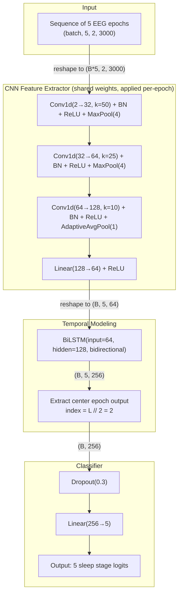
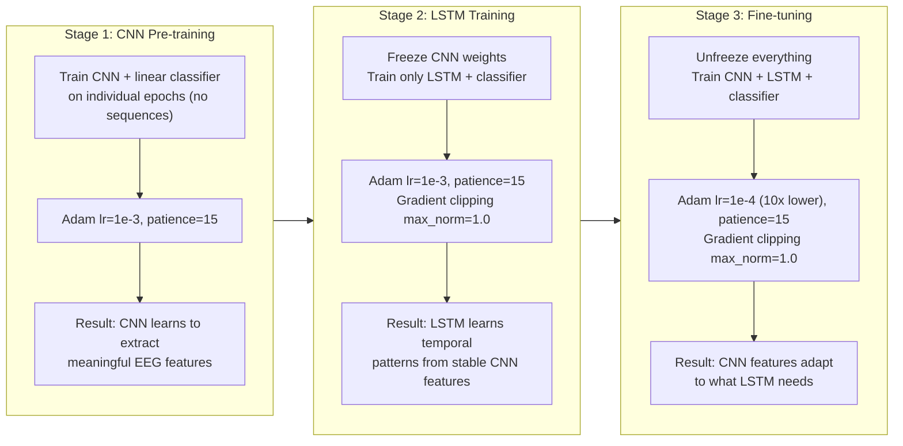
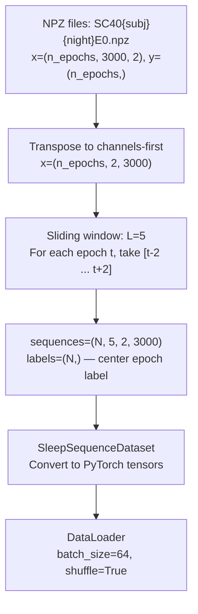

# CNN+BiLSTM for Sleep Stage Classification

Temporal extension of the DeepSleepNet-Lite baseline (Jupyter Notebook - `DeepLearning_GroupProject_WI2026.ipynb`). Instead of flattening consecutive epochs into a single long input vector, this model processes each epoch independently through a CNN, then feeds the resulting feature sequence into a bidirectional LSTM that learns sleep stage transition patterns.

Built on the same data and 20-fold split (`data_split_v1.npz`) for direct comparison.

## Files

| File                            | What it does                                                        |
| ------------------------------- | ------------------------------------------------------------------- |  
| `data_loader.py`                | Loads NPZ files, creates sliding-window sequences, PyTorch Datasets |
| `models.py`                     | CNN feature extractor, CNN+BiLSTM model definitions                 |
| `train_sequence.py`             | Three-stage training loop with early stopping                       |
| `output/train_fold0_L5.log`     | Full training log from Fold 0 run                                   |
| `output/cnn_bilstm_fold0_L5.pt` | Trained model checkpoint                                            |

## Why Temporal Modeling?

Sleep stages are not independent. They follow biological transition rules — you don't jump from deep sleep (N3) directly to REM without passing through lighter stages first. A clinician scoring a PSG always looks at surrounding epochs for context.

The DeepSleepNet-Lite approach concatenates 3 epochs into a 9000-sample vector and feeds it through a CNN. This captures some local context, but the CNN treats the entire input as a spatial signal — it has no notion of "this part is epoch 1, this part is epoch 2, this part is epoch 3." The temporal ordering is implicit at best.

The CNN+BiLSTM approach instead:

1. Processes each epoch separately through a shared CNN (same weights)
2. Produces a 64-dimensional feature vector per epoch
3. Feeds the sequence of feature vectors into a BiLSTM
4. The LSTM explicitly models which features came before and after

This means the model can learn patterns like "the CNN features look like N1, but the previous epoch was Wake and the next epoch shows REM features, so this is probably REM onset."

## Architecture



### Tensor shapes through the forward pass

```plaintext
Input:         (B, 5, 2, 3000)    -- 5 epochs, 2 EEG channels, 3000 samples each
  reshape  --> (B*5, 2, 3000)     -- flatten batch and sequence for CNN

  conv1    --> (B*5, 32, 750)     -- k=50, stride=1, pad=25, then MaxPool(4)
  conv2    --> (B*5, 64, 187)     -- k=25, stride=1, pad=12, then MaxPool(4)
  conv3    --> (B*5, 128, 1)      -- k=10, stride=1, pad=5, then AdaptiveAvgPool(1)
  fc       --> (B*5, 64)          -- linear projection

  reshape  --> (B, 5, 64)         -- restore sequence dimension

  BiLSTM   --> (B, 5, 256)        -- 128 hidden * 2 directions
  center   --> (B, 256)           -- take position [2] (center of 5)

  dropout  --> (B, 256)
  linear   --> (B, 5)             -- 5 sleep stage classes
```

### Parameter count

```plaintext
CNN Feature Extractor:  145,248  (conv1: 3,232  conv2: 51,264  conv3: 81,024  fc: 8,256  BN: 1,472)
BiLSTM:                 198,656  (64 input * 128 hidden * 4 gates * 2 directions + biases)
Classifier:               1,285  (256 * 5 + 5)
────────────────────────────────
Total:                  345,189
```

For comparison, DeepSleepNet-Lite (The Jupyter Notebook - `DeepLearning_GroupProject_WI2026.ipynb`) has ~648K parameters.

### Why the center epoch?

With sequence length L=5, the model sees epochs [t-2, t-1, t, t+1, t+2] and predicts the label for epoch t. The BiLSTM at position t has seen all 5 epochs (forward LSTM saw t-2 through t, backward LSTM saw t+2 through t), giving it full bidirectional context. We don't predict the edge epochs because they have one-sided context only.

## Three-Stage Training

Training the CNN and LSTM jointly from scratch is unstable — the LSTM receives random features from an untrained CNN and learns to model noise. The three-stage approach avoids this:



### Why each stage matters

**Stage 1** gives the CNN a head start. Without it, the LSTM receives garbage features on epoch 1 and has to simultaneously learn "what are good features" and "what are good temporal patterns" — too many moving parts.

**Stage 2** freezes the CNN so the LSTM trains on a stable feature distribution. If CNN weights kept changing, the LSTM would be chasing a moving target. Gradient clipping at max_norm=1.0 prevents exploding gradients (a known LSTM issue with long sequences).

**Stage 3** unfreezes everything with a 10x lower learning rate (1e-4 vs 1e-3). The CNN can now fine-tune its features for what the LSTM actually needs, but the low learning rate prevents catastrophic forgetting of what was learned in stages 1 and 2.

### Training hyperparameters

| Parameter         | Value                                       | Rationale                              |
| ----------------- | ------------------------------------------- | -------------------------------------- |
| Optimizer         | Adam                                        | Standard for this model size           |
| Weight decay      | 1e-4                                        | Mild L2 regularization                 |
| LR schedule       | `ReduceLROnPlateau(patience=7, factor=0.5)` | Halve LR if val F1 stalls for 7 epochs |
| Early stopping    | patience=15 on val F1-macro                 | Stop if no improvement for 15 epochs   |
| Gradient clipping | max_norm=1.0 (stages 2-3 only)              | Prevent LSTM gradient explosion        |
| Batch size        | 64                                          | Fits comfortably in GPU memory         |
| Loss              | CrossEntropyLoss with class weights         | Handle class imbalance (see below)     |

### Class imbalance

Sleep stage distribution is heavily skewed — N2 dominates (~~50% of epochs) while N1 is rare (~~7%). Without weighting, the model learns to predict N2 for everything and still gets 50% accuracy. We use sklearn's `compute_class_weight('balanced')` to inversely weight each class:

```plaintext
Wake: 0.963   (roughly balanced)
N1:   3.162   (3x upweighted — rarest class)
N2:   0.489   (downweighted — most common)
N3:   1.449   (slightly upweighted)
REM:  1.098   (roughly balanced)
```

## Data Pipeline

Uses the same NPZ files and `data_split_v1.npz` from the DeepSleepNet-Lite notebook.



Each recording (one subject, one night) is windowed independently — sequences never cross recording boundaries. This prevents the model from seeing context that wouldn't exist in practice (the last epoch of night 1 has nothing to do with the first epoch of night 2).

### Fold 0 data split

```plaintext
Train: 15 subjects → 32,725 sequences
Val:    4 subjects →  7,467 sequences
Test:   1 subject  →  1,960 sequences
```

## Results: Fold 0, Test Set

### Head-to-head comparison

| Metric        | DeepSleepNet-Lite (TF) | CNN+BiLSTM (PyTorch) |
| ------------- | ---------------------- | -------------------- |
| Accuracy      | 86.7%                  | **88.2%**            |
| Macro-F1      | 0.797                  | **0.833**            |
| Weighted-F1   | 0.867                  | **0.882**            |
| Cohen's Kappa | 0.825                  | **0.846**            |
| Parameters    | ~648K                  | **345K**             |

### Per-class F1

| Stage | DeepSleepNet-Lite | CNN+BiLSTM | Change     |
| ----- | ----------------- | ---------- | ---------- |
| Wake  | 0.904             | **0.931**  | +0.027     |
| N1    | 0.412             | **0.554**  | **+0.142** |
| N2    | **0.887**         | 0.877      | -0.010     |
| N3    | 0.931             | **0.946**  | +0.015     |
| REM   | 0.849             | **0.854**  | +0.005     |

### Per-class precision and recall (CNN+BiLSTM)

| Stage | Precision | Recall | Support |
| ----- | --------- | ------ | ------- |
| Wake  | 0.967     | 0.898  | 363     |
| N1    | 0.561     | 0.547  | 117     |
| N2    | 0.950     | 0.815  | 623     |
| N3    | 0.937     | 0.956  | 517     |
| REM   | 0.752     | 0.988  | 340     |

### Confusion matrix (CNN+BiLSTM, test set)

```plaintext
              Predicted
              Wake   N1    N2    N3   REM
Actual Wake [ 326   30     2     0     5 ]
       N1   [   6   64     4     2    41 ]
       N2   [   3   17   508    31    64 ]
       N3   [   1    0    21   494     1 ]
       REM  [   1    3     0     0   336 ]
```

### What improved and why

**N1 (+0.142 F1):** N1 is the transitional stage between Wake and deeper sleep. In isolation, N1 epochs look very similar to Wake (both have relatively low-amplitude, mixed-frequency EEG). The BiLSTM can see that the previous epoch was Wake and the next epoch shows N2 features, making it more confident this transitional epoch is N1 rather than Wake.

**Wake (+0.027 F1):** Similar reasoning — Wake epochs adjacent to N1 can be ambiguous, but temporal context helps distinguish "drifting off" (N1) from "briefly aroused" (Wake within a sleep period).

**REM (+0.005 F1, 98.8% recall):** REM has distinctive EEG patterns but can be confused with N1 in single-epoch classification. The BiLSTM learns that REM typically occurs in longer bouts and follows N2, which helps resolve edge cases.

**N2 (-0.010 F1):** Slight decrease, within noise. N2 is the most common stage and benefits least from temporal context since it's rarely ambiguous.

### Training progression

```plaintext
Stage 1 — CNN pretrain:     22 epochs, best val F1-macro = 0.787
Stage 2 — LSTM (frozen CNN): 36 epochs, best val F1-macro = 0.812  (+0.025)
Stage 3 — Fine-tune:        29 epochs, best val F1-macro = 0.814  (+0.002)
                                                           ─────
                                       Total improvement:   +0.027 over CNN-only
```

Stage 2 (adding the LSTM) provided the bulk of the improvement. Stage 3 fine-tuning gave a small additional gain.

---

## Running on Google Colab

This was developed and tested on a MacBook Pro M3 (Apple MPS GPU). The code auto-detects the available device, so it runs on Colab's CUDA GPUs without modification.

### Step 1: Install dependencies

The only packages needed beyond Colab's defaults are PyTorch (already installed) and scikit-learn (already installed). Nothing extra to install.

### Step 2: Upload files

Upload these three files to the Colab working directory:

- `data_loader.py`
- `models.py`
- `train_sequence.py`

### Step 3: Point to the data

The data paths in `data_loader.py` assume a relative directory structure:

```plaintext
code/
├── data_loader.py
├── models.py
├── train_sequence.py
└── ../data/SleepEDF/processed/
    ├── eeg_FpzCz_PzOz_v1/    ← NPZ files here
    └── data_split_v1.npz
```

If your data lives somewhere else (e.g., Google Drive), edit lines 19-22 in `data_loader.py`:

```python
# Change these to your actual paths:
DATA_DIR = '/content/drive/MyDrive/SleepEDF/processed/eeg_FpzCz_PzOz_v1'
SPLIT_PATH = '/content/drive/MyDrive/SleepEDF/processed/data_split_v1.npz'
```

Or pass them at runtime — the `get_fold_data()` function accepts `data_dir` and `split_path` as optional arguments.

### Step 4: Run training

```bash
!python train_sequence.py --fold 0 --seq_len 5 --batch_size 64
```

On a Colab T4 GPU, expect ~5-10s per epoch for CNN pretrain and LSTM stages, ~15-20s per epoch for fine-tuning. Total wall time should be around 20-30 minutes for fold 0.

### Step 5: Verify data pipeline (optional)

```bash
!python data_loader.py    # prints shapes, fold split info, class distribution
!python models.py         # runs forward/backward pass, prints parameter counts
```

### Full 20-fold cross-validation

```python
# Run all folds (sequentially — takes a while)
for fold in range(20):
    !python train_sequence.py --fold {fold} --seq_len 5 --batch_size 64
```

### CLI arguments

```plaintext
--fold           Fold index, 0-19 (default: 0)
--seq_len        Sequence length — should be odd: 3, 5, 11, 21 (default: 5)
--batch_size     Batch size (default: 32)
--lstm_hidden    LSTM hidden size (default: 128)
--lstm_layers    Number of LSTM layers (default: 1)
--dropout        Dropout rate (default: 0.3)
--cnn_epochs     Max epochs for Stage 1 (default: 50)
--lstm_epochs    Max epochs for Stage 2 (default: 50)
--finetune_epochs Max epochs for Stage 3 (default: 30)
--skip_pretrain  Skip Stage 1, use random CNN init
--output_dir     Where to save checkpoints (default: output/)
```

---

## Possible next steps (only if time permits)

- **Sequence length ablation**: Run L=3, 5, 11, 21 and compare. Longer sequences give the
LSTM more context but increase memory usage and may not help if transitions are local.
- **Full 20-fold CV**: Run all folds to get mean/std metrics for the paper.
- **Attention mechanism**: Replace or augment the BiLSTM with multi-head self-attention
(Transformer-style) to see if learned attention weights are more interpretable than
LSTM hidden states.
